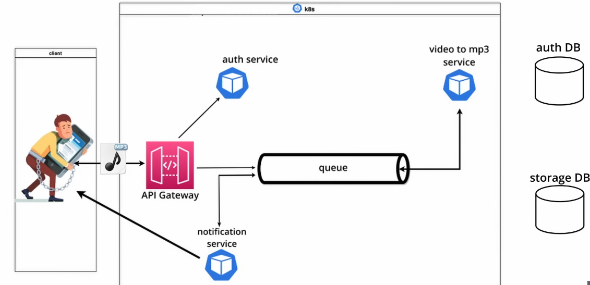

# Microservice Architecture Project w/ Python and Kubernetes - Video to MP3 Converter

This project is a WORK IN PROGRESS. I am using it to teach myself the fundamentals of microservice architecture and system design, utilizing Python and Kubernetes. Utlizes Flask for servers, Kubernetes for deployment and scaling, RabbitMQ for inter-service communication, mongoDB for storage and mySQL for authentication. The document below serves to explain the various services as well as the technologies behind them. 

## Overall Design

- A microservices based application which takes video files, extracts the audio from them, and returns an mp3 file to the user
- Uses Python, Docker, Kuberneters, MongoDB, MySQL, RabbitMQ (message broker)
  
    
    
- Key Terms
    - Synchronous Interservice Communication - client service sending a request awaits the response of the server, it cannot perform other tasks while waiting
        - such a request is called a blocking request, eg: our authentication service
    - Asynchronous Interservice Communication - client service does not need to wait for a response, we achieve this via messages on a queue (RabbitMQ)
    - Strong Consistency - data is always consistent between user, services, and databases
    - Eventual Consistency - data is eventually consistent between user, services, and databases (eg: our user has to wait a couple of minutes before retreiving their file)
    - Competing Consumers Pattern - to scale, a producer of messages in a queue can have multiple consumers, which increase speed of working through the messages producing output
    - Deployment (in kubernetes) - manages the deployment and scaling of a set of pods which have identical container spec
      
        
        
        - Stateful Set - similar to deployment but each pod has its own unique identifier which it maintains between scaling/rescheudling etc
            - if a pod fails, its respective volume can be matched to it with the unique id, ensuring data is not lost

## Setup

- Installed the following applications:
    - Docker Desktop
    - Kubectl (for kubernetes)
    - minikube (to use kubernetes on local machine)
    - k9s (kubernetes CLI tool)
    - python
    - mysql

## Services

- General:
    - localhost vs 0.0.0.0: localhost is a loopback address which can only be accessed on host machine, while 0.0.0.0 is a wildcard address which tells a server to listen on any available IPs
    - On a single machine, these two would behave more or less identically, but in a dockerized application, [localhost](http://localhost) only listens within the container while 0.0.0.0 will tell Flask to listen on whatever ip address gets assigned to the container (thus dynamically setting it)
    - The minikube tunnel is setup to route traffic from 127.0.0.1 to the gateway service inside the kubernetes cluster, and [mp3converter.com](http://mp3converter.com) is set to route to 127.0.0.1 which makes the following chain:
        - (user types in) mp3converter.com → (reroutes to) 127.0.0.1 → (kubernetes ingress sends traffic from here to) gatewayService URL
- Docker
    - server is run on a lightweight python image and requirements are installed before code is copied in (because of docker layer(build) caching)
    - while in venv, used the following command to create requirements.txt for dockerfile
      
        ```bash
        pip3 freeze > requirements.txt
        ```
    
- Kubernetes
    - uses the specific service’s code pushed as a docker image onto our docker hub repository, we deploy this into kubernetes
    - within the manifests directory, the infrastructure code does the following:
        - auth-deploy.yaml - contains info for Deployment kind, and spec which specifies number of replicas and how to regenerate pods etc, then contains spec on each pod (template/spec) such as which docker image and env variables to use
        - configmap.yaml - contains the environment variables for mqsql database, username etc
        - secret.yaml - contains sensitive information for environment variables such as db password
        - service.yaml - the group of pods with a specific URL (eg: 0.0.0:5000)
        - ingress.yaml - allows requests from outside of the kubernetes cluster inside to a specific service
        - StatefulSet - ensured data is persistent through pod crashes, etc and each pod has its own id and linked volume
            - uses volumes with a persistentVolumeClaim, which contains info like how much of the real physical storage to allocate for this volume, etc
              
                
    
- RabbitMQ - the message broker used by the services to communicate with one another.
    - Workflow:
        - when the gateway service receives a video, it sends a message to rabbitMQ, which in turn notifies downstream services to begin processing the video, etc
        - when a video is processed (and turned into an mp3), the service stores the result in the storage database and sends a message to rabbitMQ, which is consumed by the notification service.
        - this notification service then sends an email to the user to let them know the video is done
    - Structure
        - has two queues, one to notify mp3converter of new video, the other to notify notification service of conversion complete
        - uses an exchange which decides which queue to put a message in
- Auth Service - uses flask to create a simple server, with authentication through mqsql
    - utilizes basic authentication and JWT for API authentication
    - server takes login credentials, compares with database and returns a JWT if successful login
    - this JWT is then used in the validate endpoint to grant user access to all other endpoints
- Gateway Service - the interface for the user to interact with the application via API calls
    - uses MongoDB with GridFS to store videos into chunks (as the file size is too large for a single entry)
    - after storing the input video into mongoDB, it sends a message to RabbitMQ to notify it
    - allows user to login, upload videos, and download mp3s
- Converter Service - hosts the script which converts videos into mp3s
    - consumes messages placed on the video queue, which contain video ID
    - retrieves videos from mongo database based on video ID, converts video to mp3, puts mp3 file id on mp3 queue
- currently stuck on getting mysql up and running locally
    - need to follow forum advice for mysql and mongo for containerizing them